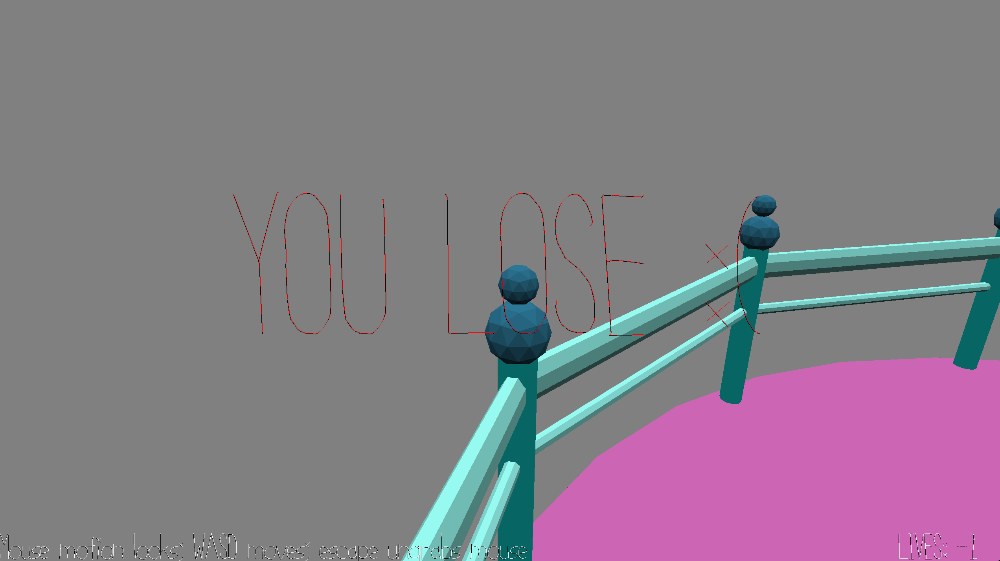

# Driver's Test

Author: Kavya Tummalapalli

Design: My game is new and interesting because rather than using the crash detection system to help move seamlessly in a game, in this case the purpose of my game is to avoid those crashes.

Screen Shot:

How To Play:

Drive around using the wasd keys and try not to crash. You have 10 lives, try to stay alive as long as possible!

This game was built with [NEST](NEST.md).

